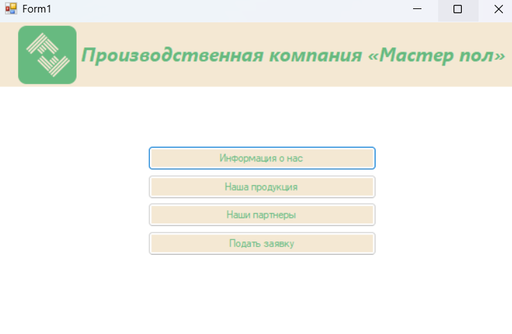
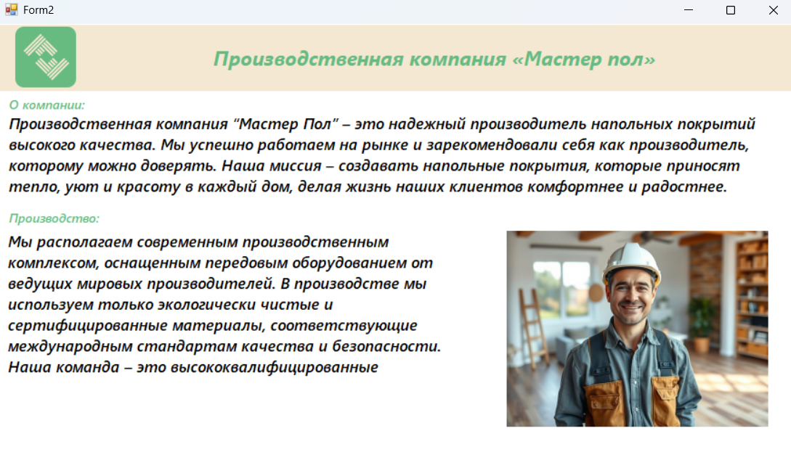
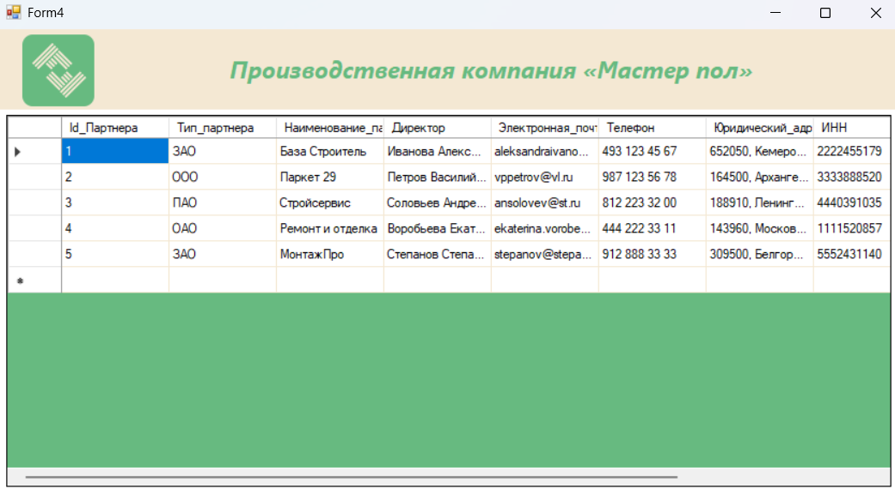
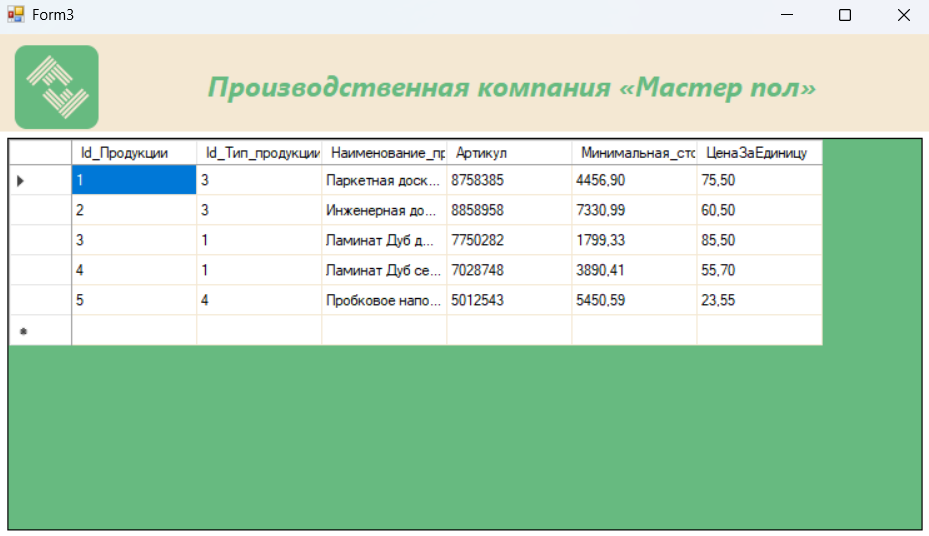
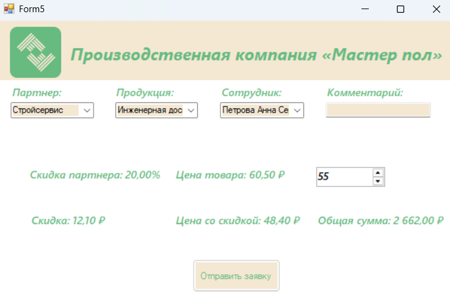

# MasterFloor: Система управления производством напольных покрытий

## Описание

Этот проект представляет собой Windows Forms приложение на .NET Framework, разработанное для производственной компании «Мастер пол», специализирующейся на производстве и реализации напольных покрытий. Система предназначена для оптимизации деятельности компании путем автоматизации ключевых процессов и управления данными в следующих подсистемах: продукция, склад и материалы, производство, сотрудники и партнеры.

## Особенности
Партнеры покупают продукцию со скидками, которые зависят от общего 
объема их продаж. Скидки мотивируют партнеров к большему объему продаж. 
Партнеры реализуют товары в розничных и оптовых магазинах, интернет
магазинах, другим компаниям по продаже товаров и оказанию услуг. 
Взаиморасчеты 
производственной 
осуществляются в рублях.

## Демонстрация

_Информация о компании "Мастер Пол"_

_Таблица из БД транслируется с помощью DataGridView_

_Таблица из БД транслируется с помощью DataGridView_

## Установка

1.  **Предварительные требования:**
    - Установленная операционная система Windows.
    - Установленный .NET Framework 4.7.2 или выше.
    - (Если используется база данных).
2.  **Загрузка проекта:**
    - Склонируйте репозиторий
3.  **Открытие проекта в Visual Studio:**
    - Откройте файл решения `База данных Мастер Пол.sln` в Visual Studio.
4.  **Настройка подключения к базе данных (если используется):**
    - Отредактируйте файл `App.config` или `settings.settings` (в зависимости от структуры вашего проекта) и укажите параметры подключения к вашей базе данных.
5.  **Сборка проекта:**
    - В Visual Studio выберите "Build" -> "Build Solution" (или нажмите Ctrl+Shift+B).
6.  **Запуск приложения:**
    - После успешной сборки запустите приложение из папки `bin\Debug` или `bin\Release`.

## Авторы

- Умиржанова Амира (https://github.com/umrzhnv)
